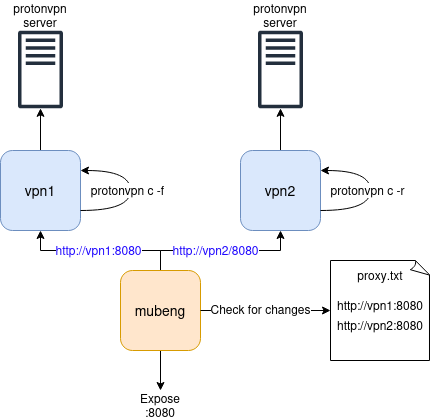

To set up and use Protoncycle, follow these detailed instructions:

### Prerequisites

1. **Docker and Docker Compose Installation**
   - Follow the official Docker installation guide for Debian: [Docker Engine Installation](https://docs.docker.com/engine/install/debian/)
   - Install Docker Compose as well, typically included in the Docker package or can be installed separately following Docker's instructions.

2. **ProtonVPN Account**
   - Ensure you have a ProtonVPN account that supports at least two simultaneous connections (paid account required).

### Quick Start Guide

1. **Clone the repository**
   ```bash
   git clone https://github.com/Enelg52/protoncycle.git
   cd protoncycle
   chmod +x ./protoncycle.sh
   ```

2. **Configure Environment Variables**
   - Edit the `.env` file to include your ProtonVPN credentials.
   ```bash
   vim .env
   ```
   - Add the following lines with your actual ProtonVPN username and password:
   ```env
   PVPN_USERNAME=your_protonvpn_username
   PVPN_PASSWORD=your_protonvpn_password
   ```

3. **Run Protoncycle**
   ```bash
   ./protoncycle.sh 60
   ```
   - This script will start and restart VPN connections at intervals of 60 seconds.

4. **Check VPN Proxy Connection**
   - Continuously check your public IP address to ensure the VPN is cycling:
   ```bash
   while true; do curl --proxy http://127.0.0.1:8080 http://ifconfig.me; echo; sleep .2; done
   ```

### How Protoncycle Works



The protoncycle.sh script restarts the VPN connections and adapts the list of accessible proxies for Mubeng. Then it sleeps for a specified interval and starts again. This way, you always have at least one accessible VPN connection.

### Adding Certificates

To ensure the certificates are properly added while Protoncycle is running:

1. **Download the Certificate**
   ```bash
   wget http://127.0.0.1:8080/cert
   ```

2. **Convert and Install the Certificate**
   ```bash
   openssl x509 -inform der -in cert -out goproxy-cacert.crt
   sudo mv goproxy-cacert.crt /usr/local/share/ca-certificates/
   sudo update-ca-certificates
   ```

### Additional Configuration

- For more environment variables and configurations, refer to:
  - [Proton-privoxy configuration](https://github.com/walterl/proton-privoxy?tab=readme-ov-file#configuration)
  - [ProtonVPN CLI usage](https://github.com/Rafficer/linux-cli-community/blob/master/USAGE.md)

### Usage Summary

- To run the Protoncycle script, use:
  ```bash
  ./protoncycle.sh <sleep_time_in_seconds>
  ```
  - Replace `<sleep_time_in_seconds>` with the desired interval between VPN restarts.

### Credits

- The Protoncycle project relies on the work of:
  - [Proton-privoxy](https://github.com/walterl/proton-privoxy)
  - [Mubeng](https://github.com/kitabisa/mubeng)